

  

# Andy's Selective Grief Protection

**Current release: 0.1.7**

[Download the 0.1.7 MCADDON](Andys_Selective_Grief_Protection_0.1.7.mcaddon) · [CurseForge](https://www.curseforge.com/minecraft-bedrock/addons/andys-selective-grief-protection) · [Comprehensive Player Guide](https://github.com/CharlesJGantt/Andys-Selective-Grief-Protection/wiki)

SHA-256: `3957e3e982700052b25932b906876902263eb973c546e3ec02ee7d07d85f17fc`

Protect the parts of a Minecraft Bedrock world that matter without turning the whole world into an untouchable claim. Place a Protection Rune, choose its radius and rules, and keep the surrounding world open for normal mining, building, and exploration.

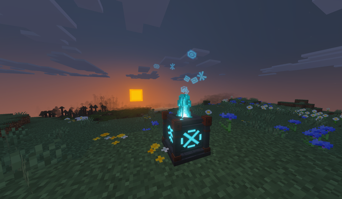

Version **0.1.7** is achievement friendly, uses stable Script APIs, supports Bedrock Dedicated Server administration, declares Vibrant Visuals/PBR resources, and requires no experiments, beta APIs, or cheats.

## Vanilla-friendly design

The add-on preserves ordinary Minecraft systems and lets the world owner choose exactly which actions and explosion effects to restrict. It does not replace vanilla mobs, change gamerules, add factions, or require a companion add-on.

## Requirements

Use Minecraft Bedrock 26.30 or newer with both included packs active. Keep cheats and experiments off. The Behavior Pack supplies the protection logic; the Resource Pack supplies the rune, grid, flame, particle, and PBR resources.

## What the add-on protects

Each Protection Rune controls a square footprint in its own dimension. A radius of 16 covers 33 × 33 blocks. Protection extends exactly 20 blocks below and 20 blocks above the rune, for 41 vertical layers. This bounded height lets players protect a house, storage floor, workshop, or village section without automatically locking every cave beneath it.

Every rune can independently control:

- Block placement and breaking
- Containers and inventory blocks
- Ordinary block interaction
- Item use inside the area
- Entity interaction
- Attacks against non-player entities
- Player-versus-player damage
- Explosion block damage by source
- Explosion entity damage by source
- Trusted players and their roles
- Persistent and temporary boundary grids
- Floating runes, soul flame, and soul-flame sounds

When protected areas overlap, an action is allowed only when every containing rune allows it. The most restrictive applicable protection therefore wins.

## Installation

1. Open the downloaded **Andys_Selective_Grief_Protection_0.1.7.mcaddon** file.
2. Let Minecraft import both included packs.
3. Activate the **Andy's Selective Grief Protection Behavior Pack** on the world. Its paired resource pack should activate with it.
4. Enter the world and craft or obtain a Protection Rune.

No experimental world toggles or cheats are required. Existing worlds can use the add-on after the packs are activated. Keep both packs enabled together.

## Quick start

1. Craft a Protection Rune with the recipe below.
2. Place it where the center of the protected area should be.
3. Crouch and interact directly with the rune.
4. Choose the radius, explosion preset, player profile, and grid state.
5. Add trusted members or adjust individual restrictions as needed.

## Craft a Protection Rune

Use this shaped crafting recipe:

- Top: Copper Ingot, Diamond, Copper Ingot
- Middle: Amethyst Shard, Chiseled Deepslate, Amethyst Shard
- Bottom: Copper Ingot, Redstone Block, Copper Ingot

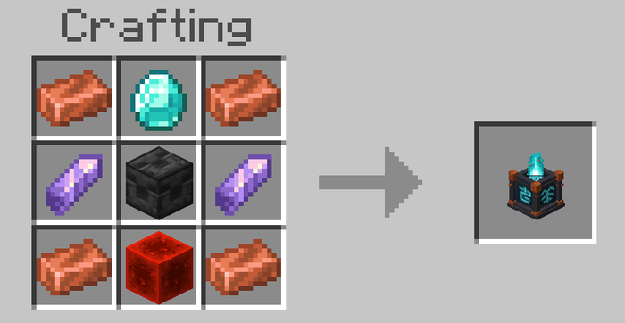

A newly crafted rune starts at **Tier I**, with a maximum radius of 16.

## Place and open a rune

Place the rune on a stable block. The player who places it becomes its owner.

**To open the rune settings, crouch and interact directly with the placed rune. No control stick is required.** The owner, a world operator, or a trusted player with the Manager role can open the menu. The menu header shows the owner, tier, effective radius and footprint, protected Y range, dimension, protection state, and explosion mode.

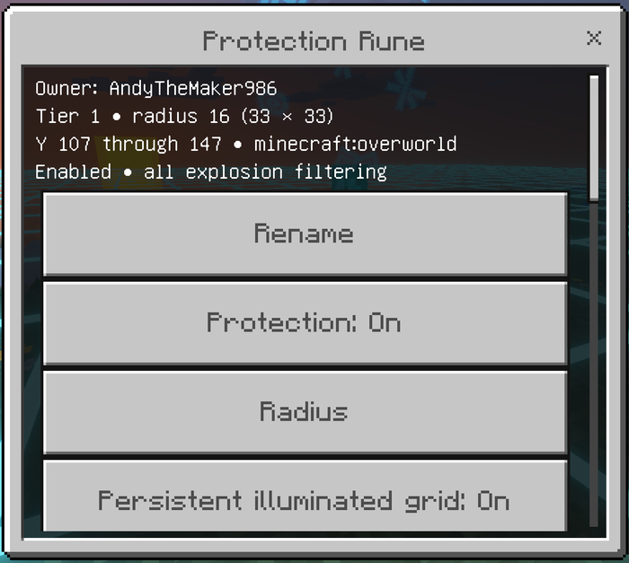

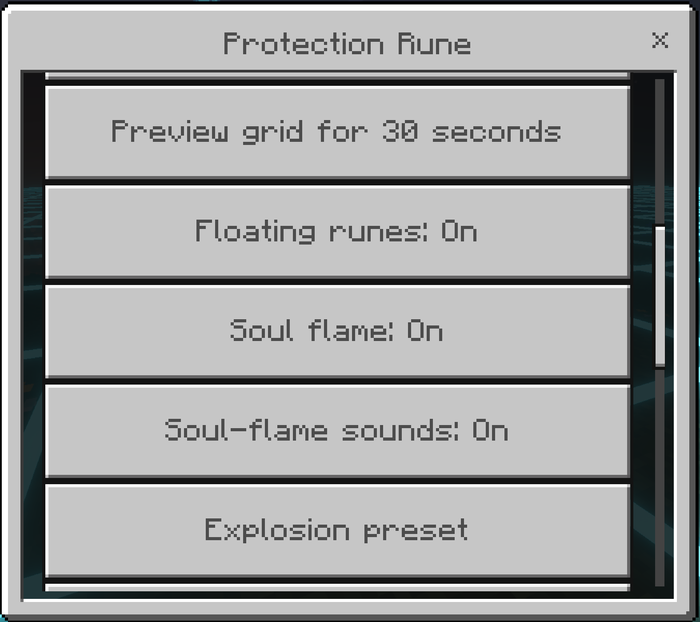

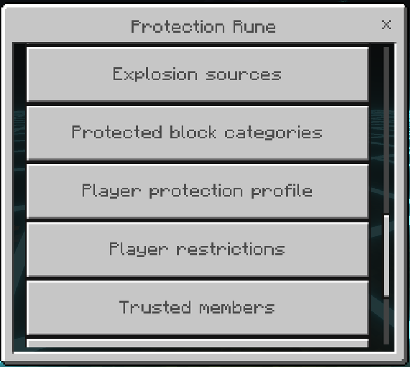

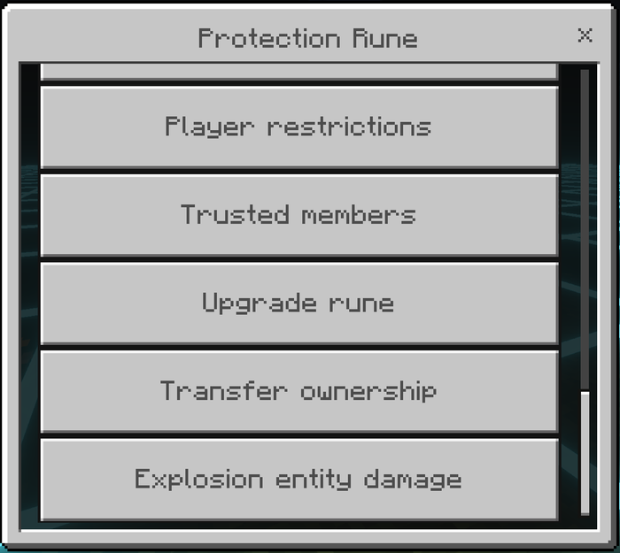

Only the owner or an operator can break a rune. Breaking it removes its stored protection record and drops a fresh Tier I rune. Upgrades are not retained in the dropped item.

## Every Protection Rune menu option

### Rename Rune

Give the rune a name from 1 to 48 characters. Formatting codes are removed. The name is used in menus and administration lists.

### Protection

Turns this rune's protection on or off. Turning it off keeps the rune record and configuration but suspends its local restrictions, explosion rules, grid, and ambience until it is enabled again.

### Radius

Sets the horizontal radius from 1 up to the lower of the rune's tier cap and the world maximum. The footprint is always a square measuring **2 × radius + 1** on each side. The menu rejects a change that violates the world's overlap or minimum-distance rules.

Tier caps are:

- Tier I: radius 16
- Tier II: radius 32
- Tier III: radius 64
- Tier IV: radius 128
- Tier V: radius 256

### Persistent Illuminated Grid

Shows or hides a one-block boundary grid around the footprint. The world-level grid setting must also be enabled. The grid is a horizontal guide just above the rune's level; it does not form walls or follow terrain.

### Preview Grid for 30 Seconds

Temporarily displays the boundary without changing the persistent-grid setting. The player must have **Personal grid preview** enabled, and the administrator must have world grids enabled.

### Floating Runes

Turns the rune particles rising from the top on or off. This setting is independent of the flame and sound settings.

### Soul Flame

Turns the animated soul-flame visual on or off. It uses the familiar soul-campfire flame appearance.

### Soul-Flame Sounds

Turns the quiet flame ambience on or off without changing the flame visual.

Ambience only runs while the rune is active, loaded, and near a player. It does not create a ticking area.

### Explosion Preset

Applies a complete starting configuration for protected explosion sources, block mode, and entity-damage switches:

- **Vanilla:** no explosion sources receive protection.
- **Creeper Safe:** Creeper and Charged Creeper; protects all blocks.
- **Mob Explosion Safe:** Creeper, Charged Creeper, Ghast, Wither, and Wither Skull; protects all blocks.
- **Survival Balanced:** Creeper, Charged Creeper, and Ghast; protects all blocks.
- **Build Safe:** Creeper, Charged Creeper, and Ghast; protects Critical blocks.
- **Full Protection:** all built-in sources, including Unknown; protects all blocks.

Applying a preset replaces the rune's current explosion sources and block mode and resets all explosion entity-damage switches to off. Individual controls can then be adjusted.

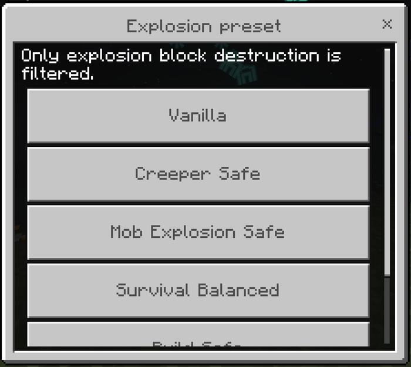

### Explosion Sources

Individually enables or disables block protection for:

- Creeper
- Charged Creeper
- Ghast fireball
- TNT
- TNT minecart
- End crystal
- Wither
- Wither skull
- Unknown or unattributed explosions, including beds and respawn anchors

The corresponding world source switch is a master control. A source disabled by an administrator cannot be re-enabled by an individual rune.

### Protected Block Categories

Chooses which impacted blocks are removed from protected explosion lists:

- **All:** every block in the rune's volume.
- **Critical:** Storage and Redstone blocks plus enchanting tables, anvils, beacons, lodestones, respawn anchors, spawners, and administrator-defined custom blocks.
- **Storage:** chests, trapped chests, barrels, ender chests, hoppers, dispensers, droppers, furnaces, blast furnaces, smokers, brewing stands, crafters, shulker boxes, and custom blocks.
- **Redstone:** rails, repeaters, comparators, redstone wire and blocks, observers, pistons, hoppers, droppers, dispensers, targets, buttons, levers, pressure plates, daylight detectors, redstone torches, redstone lamps, and custom blocks.
- **Custom:** only the block identifiers entered by an administrator.

Explosion protection filters blocks from the explosion. It does not cancel the blast, its sound, or its particles.

### Player Protection Profile

Applies a starting set of restrictions:

- **Open:** permits all tracked player actions.
- **Build:** blocks placement and breaking.
- **Storage:** blocks placement, breaking, and container access.
- **Base:** blocks placement, breaking, containers, item use, entity interaction, and attacks against non-player entities. Ordinary block interaction and PvP remain open.
- **Private:** blocks every tracked player action except PvP. Configure the PvP switch separately when a rune should block player-versus-player damage too.

Applying a profile replaces the current restriction set. Use **Player Restrictions** afterward for exact control.

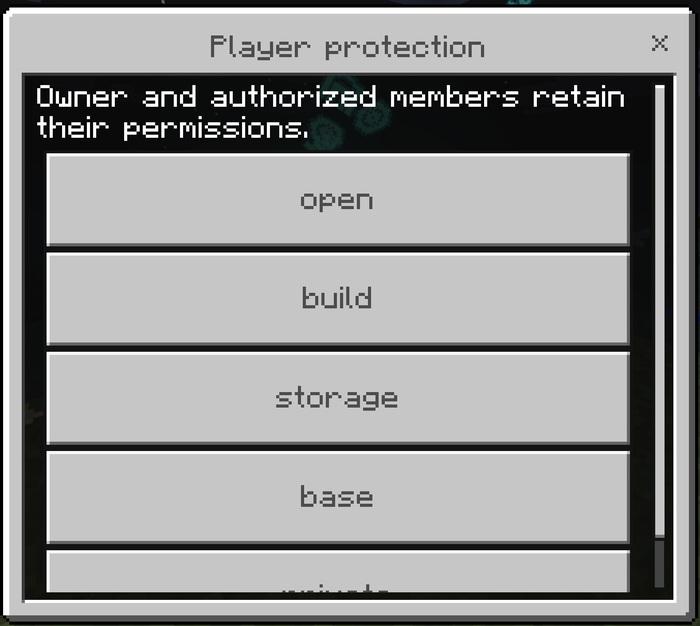

### Player Restrictions

Controls each action separately:

- **Block placement:** recognized placement at the selected or adjacent position.
- **Block breaking:** breaking blocks inside the protected volume.
- **Containers:** use of recognized storage and inventory blocks.
- **Block interaction:** ordinary interactions that are not handled as containers.
- **Item use:** supported held-item use at a protected position.
- **Entity interaction:** interacting with entities.
- **Attack entities:** direct player-attributed damage to non-player entities.
- **PvP:** direct player-attributed damage to another player.

These switches define restrictions for visitors. Owners, operators with bypass enabled, and trusted members with the relevant permission can perform the action.

### Trusted Members

The owner or an operator can add an online player, remove a member, or change a member's role:

- **Visitor:** block interaction.
- **Friend:** block interaction and entity interaction.
- **Builder:** build, break, containers, block interaction, item use, and entity interaction.
- **Technician:** containers, block interaction, item use, and entity interaction.
- **Manager:** all eight action permissions and access to routine rune configuration.
- **Custom:** choose the eight permissions individually.

Managers can configure routine protection and visual settings. Ownership-only actions remain with the owner or an operator: breaking the rune, changing membership, upgrading, and transferring ownership.

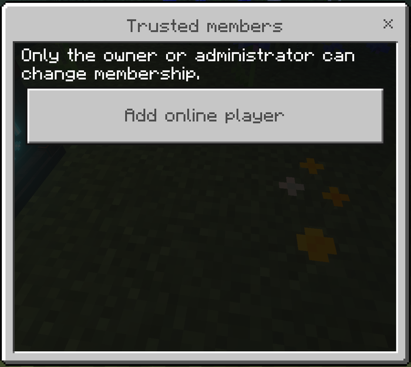

### Upgrade Rune

The owner or an operator can upgrade while within 8 blocks of the loaded rune. The add-on verifies the complete cost before consuming materials. A successful upgrade expands the selected radius to the new tier cap, limited by the world maximum and overlap rules.

Standard upgrade costs:

- Tier II: 1 Diamond Block, 8 Crying Obsidian, 8 Amethyst Blocks
- Tier III: 4 Netherite Ingots, 8 Diamond Blocks, 8 Echo Shards
- Tier IV: 1 Nether Star, 2 Netherite Blocks, 16 Diamond Blocks, 16 Echo Shards
- Tier V: 2 Nether Stars, 4 Netherite Blocks, 32 Diamond Blocks, 32 Echo Shards

The **Expensive** cost mode doubles these costs. **Free** removes the material cost. Administrators can also limit the highest available tier.

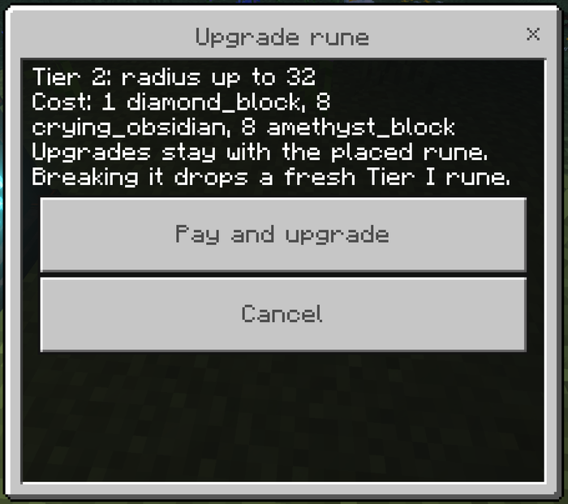

### Transfer Ownership

Transfers the rune to an online player. The new owner is removed from the trusted-member list because ownership supersedes membership. The former owner loses owner access unless added back as a trusted member.

### Explosion Entity Damage

Separately controls whether each explosion source may damage entities in the protected volume. All entity-damage protection is off by default, so players can protect builds while keeping ordinary explosion combat behavior. World source switches and dimension settings still apply.

## Personal settings and PlayerGriefControl

Rename a vanilla stick exactly **PlayerGriefControl** in an anvil. Use it, or interact with a block or entity while holding it, to open the player menu.

The stick is a convenience for opening personal settings and finding every rune the player can manage. It is not required to configure a nearby rune; crouch-interacting with the rune opens that menu directly.

The player menu contains:

- **Explosion feedback:** Off, Compact, or Detailed. Compact reports the number of protected blocks. Detailed also names the explosion source. Feedback appears only near the protected explosion.
- **Warnings:** enables or hides denial messages and explosion feedback for that player. It never changes enforcement.
- **Personal grid preview:** allows or prevents that player from requesting a 30-second preview. It does not hide another player's persistent grid.
- **Manageable runes:** lists owned runes, all runes for operators, and runes where the player has the Manager role.

## World administration and AdminGriefControl

Rename a vanilla stick exactly **AdminGriefControl** in an anvil. A world operator can use it or interact while holding it to open the administration menu.

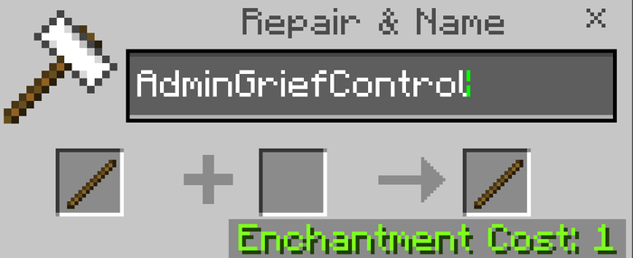

Holding the named stick does not grant permission. The player must already be an operator.

### World Settings

- **Add-on enabled:** master switch for all protection.
- **Explosion scope:** Global, Ward, or Hybrid. Global uses dimension rules everywhere; Ward uses rune rules inside rune volumes; Hybrid applies both.
- **Protection Runes enabled:** enables or suspends rune-based protection.
- **Player protection enabled:** master switch for rune player restrictions.
- **Admin-only rune placement:** limits placement to operators.
- **Rune upgrades enabled:** permits or suspends upgrades.
- **Allow different-owner overlap:** permits overlapping rune volumes when the minimum distance is zero. A positive minimum distance still requires a gap.
- **Minimum rune distance:** 0–128 blocks.
- **Operator bypass:** lets operators ignore rune player restrictions.
- **Grid enabled:** master switch for persistent and preview grids.
- **Console logging:** writes protected-explosion summaries to the content log.

Runes owned by the same player may overlap or stack. With different owners, overlap is rejected by default. Vertical separation matters: distance checks apply when rune centers are within 40 vertical blocks.

### Protection Feature Switches

World-level master controls for Block placement, Block breaking, Containers, Block interaction, Item use, Entity interaction, Attack entities, and PvP. Disabling a category suspends that type of rune restriction worldwide.

### Explosion Source Switches

World-level master controls for Creeper, Charged Creeper, Ghast, TNT, TNT Minecart, End Crystal, Wither, Wither Skull, and Unknown. Each source must be enabled here before dimension or rune rules can protect it.

### Dimension Explosion Rules

The Overworld, Nether, and End each have independent settings:

- Enable or disable explosion protection in the dimension.
- Choose All, Critical, Storage, Redstone, or Custom block mode.
- Enable or disable each built-in and custom explosion source.
- Enable or disable entity-damage protection for every source.
- Apply a preset to replace that dimension's mode and source switches.

Applying a dimension preset also resets its entity-damage switches to off.

### Default Presets and Limits

- **Maximum rune tier:** Tier I–V.
- **Maximum radius:** 1–256.
- **Maximum runes per player:** 1–64; default 8.
- **Maximum trusted members:** 0–48; default 24.
- **Upgrade cost:** Standard, Expensive, or Free.
- **Default player profile:** Open, Build, Storage, Base, or Private.
- **Default explosion preset:** any listed explosion preset.

The add-on also has a hard storage limit of 512 registered runes per world.

### Manage All Runes

Lists stored rune records across the world. Operators can inspect a rune, open its settings, enable or disable it, transfer it to an online player, or remove a stale record.

### Custom Protected Blocks

Accepts up to 128 comma-separated identifiers in the form **namespace:block_name**. Custom blocks are included in Critical, Storage, and Redstone modes and are the only blocks covered by Custom mode.

### Custom Explosion Sources

Accepts up to 128 comma-separated entity identifiers in the form **namespace:entity_name**. Listed entities are classified as Custom explosion sources and follow the active world, dimension, and rune Custom switches.

### Status and Limitations

Shows the active master settings and the add-on's intentional coverage limits so administrators can check configuration in game.

## Bedrock Dedicated Server console

The root command is:

`andys_sgp:admin`

Use it without a leading slash in the dedicated-server console. In game, operators may use the slash form. Ordinary players and command blocks cannot use the administration command.

Available commands:

- `andys_sgp:admin` or `andys_sgp:admin status` — show current status.
- `andys_sgp:admin help` — show command help.
- `andys_sgp:admin list [filter]` — list settings, optionally filtered.
- `andys_sgp:admin set KEY VALUE` — change a world setting.
- `andys_sgp:admin preset DIMENSION NAME` — apply an explosion preset.
- `andys_sgp:admin runes FILTER` — list rune records.
- `andys_sgp:admin inspect ID` — inspect one rune.
- `andys_sgp:admin disable ID` and `enable ID` — suspend or restore a rune.
- `andys_sgp:admin remove ID` — remove a stale record without breaking a block.
- `andys_sgp:admin transfer ID ONLINE_NAME` — transfer ownership.
- `andys_sgp:admin custom-blocks CSV` — replace custom protected block IDs.
- `andys_sgp:admin custom-sources CSV` — replace custom explosion source IDs.
- `andys_sgp:admin reload` — reload stored configuration.
- `andys_sgp:admin reset confirm` — reset world settings while retaining rune records.

Boolean values accept `on`, `off`, `true`, and `false`. Quote names that contain spaces. Changes take effect immediately. Administrative mutations are logged; explosion summaries follow the Console logging setting.

## Grids and visual effects

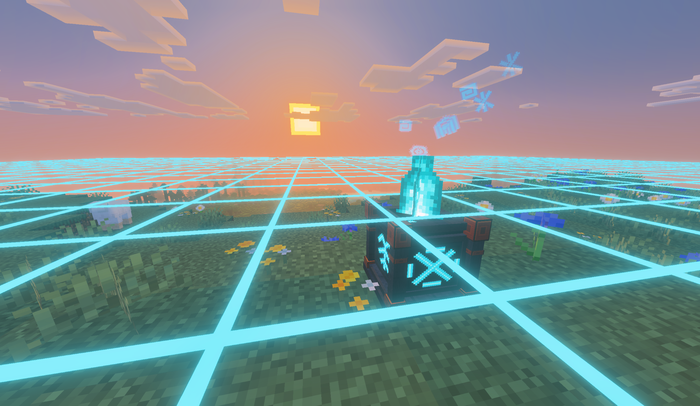

The illuminated grid marks the exact square footprint using one-block segments. It is a visual aid only; missing or unloaded grid helpers do not weaken protection.

To avoid forcing chunks to stay loaded, the grid:

- Appears only around nearby loaded runes.
- Uses no ticking areas.
- Has a world-wide visual-helper limit.
- Draws horizontally near the rune rather than as a vertical wall.

Each physical rune has four distinct side glyphs. Floating runes, the soul-campfire-style flame, and the quiet flame sound can be toggled independently.

## Compatibility and intentional limits

The add-on is designed for selective protection rather than hostile land claiming. Owners still decide which actions and explosions matter in each footprint.

Current protection does not comprehensively intercept:

- Piston movement and hopper transfer across a boundary
- Water, lava, and fire spreading into an area
- Blocks lost because an unprotected support block was destroyed
- Enderman block movement
- Wither dash/contact destruction outside reported explosions
- Direct world edits performed by commands, editors, or other add-ons
- Every unusual multi-block, replaceable-block, custom-item, projectile, or unattributed damage path

Protection records may remain after a rune block is removed by a command or editor; operators can remove stale records from the admin menu or console. When another add-on independently cancels the same event, the strictest result may win.

## Troubleshooting

- **A menu does not open:** crouch and interact with the rune, or verify the exact case-sensitive control-stick name and interact while holding it.
- **Admin access is refused:** the player must be an actual operator; a renamed stick does not grant access.
- **Protection appears outside runes:** choose Ward explosion scope instead of Global or Hybrid.
- **A larger radius is unavailable:** check the rune tier, world maximum radius, maximum tier, overlap rules, and minimum distance.
- **A distant grid edge is missing:** move closer so that section is loaded. Protection remains active even when a visual helper is absent.
- **The rune or its textures are missing:** confirm both 0.1.7 packs are active and inspect the Content Log for block, geometry, texture, or script errors.

## Links and support

- [Comprehensive Player Guide](https://github.com/CharlesJGantt/Andys-Selective-Grief-Protection/wiki)
- [Source, downloads, and release notes](https://github.com/CharlesJGantt/Andys-Selective-Grief-Protection)
- [CurseForge project](https://www.curseforge.com/minecraft-bedrock/addons/andys-selective-grief-protection)

## Reporting problems

For a problem report, include the Bedrock version, add-on version, single-player/Realm/dedicated-server environment, exact reproduction steps, and relevant Content Log or server-console lines.

## End-user permission

Players may use an official, unmodified release in personal worlds, multiplayer worlds, Realms, and servers. Normal delivery of the official unmodified add-on to players joining an authorized world, Realm, or server is permitted.

## Content-creator permission

Content creators may showcase an official, unmodified release in videos, livestreams, screenshots, tutorials, reviews, articles, social posts, and original gameplay content, including monetized content. Credit to AndyTheMakerMC and a link to the official project page are appreciated whenever practical.

## License — All Rights Reserved

Copyright © 2026 Andy / AndyTheMakerMC. Separate redistribution, rehosting, repackaging, published modifications, translation, adaptation, decompilation, reverse engineering, extraction, resale, sublicensing, and reuse of the add-on, branding, assets, documentation, or promotional artwork require prior written permission.

Promotional artwork is original AI-assisted concept artwork directed for this project and is not an in-game screenshot. Minecraft is a trademark of Microsoft Corporation. This project is not affiliated with, endorsed by, sponsored by, or associated with Microsoft or Mojang Studios.
