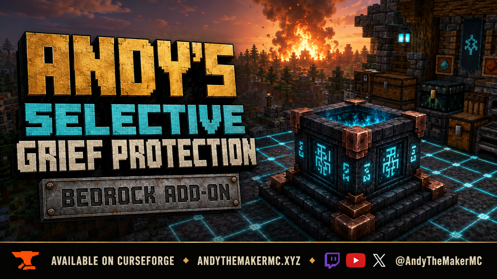

# Andy's Selective Grief Protection

**Keep the boom. Save the build.**

Configure Creeper and other explosion damage to blocks, then place owned runes to protect selected spaces from unwanted player actions. Version **0.1.7 — playtest build**.

[Download 0.1.7](Andys_Selective_Grief_Protection_0.1.7.mcaddon)

SHA-256: `3957e3e982700052b25932b906876902263eb973c546e3ec02ee7d07d85f17fc`

[View Andy's Selective Grief Protection on CurseForge](https://www.curseforge.com/minecraft-bedrock/addons/andys-selective-grief-protection)

<!-- screenshot:01:start -->
> **Screenshot 01 — Rune at dusk**
>
> Pending capture: Rune at dusk with Vibrant Visuals, glowing carvings, soul flame and visible floating glyphs.
>
> File: `01-rune-at-dusk.png`
<!-- screenshot:01:end -->

## Requirements

Minecraft Bedrock 26.30+, both included packs, stable APIs. No cheats, experiments, or companion add-ons required. Standard graphics and Vibrant Visuals assets included, with PBR and add-on product declarations. Achievement eligibility and retail/Realm/BDS operation await the documented playtest; they are not yet verified compatibility claims.

## Features

- Select Creeper, charged Creeper, Ghast, TNT, TNT Minecart, End Crystal, Wither-related or Unknown explosion policies independently.
- Choose All, Critical, Storage, Redstone or Custom block protection, with per-dimension world rules and local runes.
- Use 16/32/64/128/256 tier radius caps with expensive in-place upgrades and an emissive block grid.
- See a distinct glowing glyph on all four sides, bright floating runes above the well, and an independently configurable vanilla animated soul-campfire flame and crackle.
- Protect exactly 20 blocks above and below each rune, within its square footprint.
- Manage owners, trusted-player roles, action restrictions and optional damage/PvP prevention.
- Keep explosion damage vanilla by default. Use world/operator menus and a cheat-free BDS console command.

## Installation and controls

1. Back up your world, download and import the `.mcaddon`.
2. Activate its Behavior Pack and Resource Pack together.
3. Leave cheats and experiments off.
4. Rename a stick **PlayerGriefControl**; interact with a block to open player settings.
5. Operators use **AdminGriefControl**. A renamed stick never grants administrator access.
6. Craft a Protection Rune from four Copper Ingots, one Diamond, two Amethyst Shards, one Chiseled Deepslate, and one Redstone Block; place it and crouch + interact.

<!-- screenshot:08:start -->
> **Screenshot 08 — Personal settings**
>
> Pending capture: Player settings menu opened using the PlayerGriefControl stick.
>
> File: `08-player-settings.png`
<!-- screenshot:08:end -->

<!-- screenshot:09:start -->
> **Screenshot 09 — World and admin settings**
>
> Pending capture: AdminGriefControl menu showing individual world protection controls.
>
> File: `09-world-settings.png`
<!-- screenshot:09:end -->

<!-- screenshot:03:start -->
> **Screenshot 03 — Rune settings**
>
> Pending capture: Crouch-interact menu showing radius, protected Y limits and effect controls.
>
> File: `03-rune-settings.png`
<!-- screenshot:03:end -->

Default Hybrid scope protects Creeper/Ghast block damage globally and applies rune rules locally. Choose Ward scope for explosion protection limited to runes. A radius-16 rune at Y=64 covers a 33×33 footprint and Y=44–84. Breaking an upgraded rune returns a fresh Tier I rune.

## Protection around your build

<!-- screenshot:02:start -->
> **Screenshot 02 — Protected footprint**
>
> Pending capture: Elevated view of a radius-16 grid, including its clean outer boundary.
>
> File: `02-grid-boundary.png`
<!-- screenshot:02:end -->

<!-- screenshot:04:start -->
> **Screenshot 04 — Selective explosion protection**
>
> Pending capture: Protected construction beside explosion damage outside the footprint. Use Ward scope for this demonstration.
>
> File: `04-selective-explosions.png`
<!-- screenshot:04:end -->

<!-- screenshot:05:start -->
> **Screenshot 05 — Player protection**
>
> Pending capture: An outsider attempts to break or place a block; keep the denial feedback visible.
>
> File: `05-outsider-protection.png`
<!-- screenshot:05:end -->

<!-- screenshot:06:start -->
> **Screenshot 06 — Trusted players**
>
> Pending capture: Rune membership menu showing roles or individual permissions.
>
> File: `06-trusted-players.png`
<!-- screenshot:06:end -->

<!-- screenshot:07:start -->
> **Screenshot 07 — Rune upgrades**
>
> Pending capture: Upgrade menu showing the next tier, maximum radius and material cost.
>
> File: `07-rune-upgrades.png`
<!-- screenshot:07:end -->

The BDS console command is `andys_sgp:admin help`; `list` shows every setting. For example: `andys_sgp:admin set scope ward`. Console use has no leading slash and does not require cheats.

<!-- screenshot:10:start -->
> **Screenshot 10 — Dedicated-server console**
>
> Pending capture: Successful andys_sgp:admin list output or a settings command in BDS; crop private server details.
>
> File: `10-bds-console.png`
<!-- screenshot:10:end -->

## Compatibility and limitations

Stable interaction cancellation covers ordinary placement attempts; it is not a general placement-before API. Pistons, hopper transfers, liquid/fire spread, indirect support loss, all Wither/Enderman behavior, and other add-ons' direct block writes are not fully intercepted. Unknown explosions include unattributed bed/anchor events. Treat this version as a playtest build, not a complete hostile-server claim system. No companion integration is required or claimed.

The grid is a shared horizontal preview near rune height, rendered in nearby loaded tiles with a budget. It does not force chunks to load; distant missing tiles do not change protection. Version 0.1.3 introduced the fully collapsed clipped lines at the boundary; 0.1.7 retains it.

## Help and license

Read the [public wiki](https://github.com/CharlesJGantt/Andys-Selective-Grief-Protection/wiki) for the complete player guide. The official release is also available on [CurseForge](https://www.curseforge.com/minecraft-bedrock/addons/andys-selective-grief-protection). Report your game/add-on versions, platform, settings, reproduction steps and Content Log excerpts through [AndyTheMakerMC](https://andythemakermc.xyz).

All Rights Reserved; players and content creators may use/showcase official unmodified releases, including monetized original gameplay. See [LICENSE.md](LICENSE.md). Cover imagery is concept artwork, not an in-game screenshot. Not affiliated with Microsoft or Mojang Studios.
